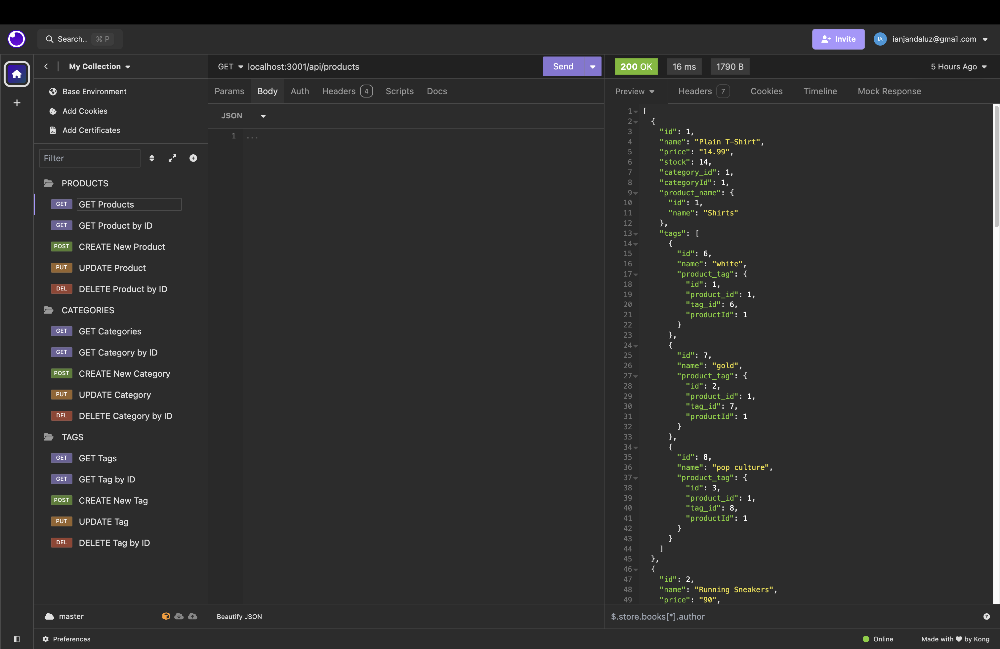
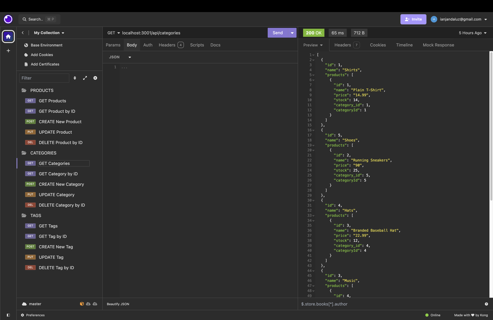
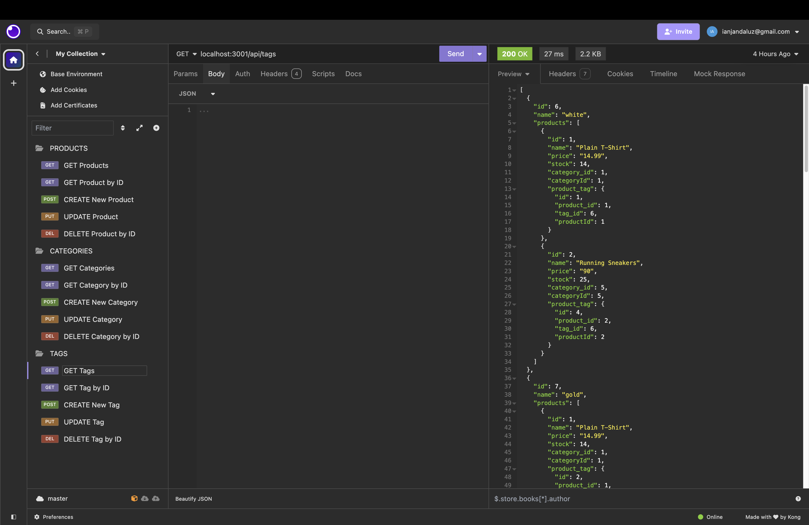
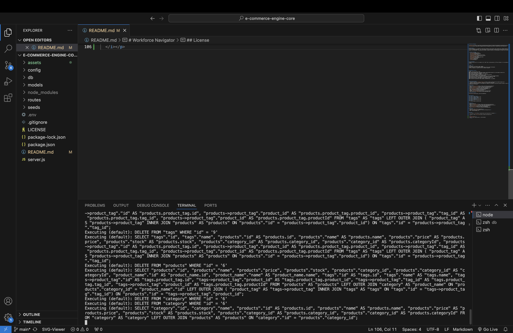

# E-Commerce Engine Core

[](https://github.com/Thecaprifire)
[](https://choosealicense.com/licenses/mit/)
  
  
## Description:
Welcome to the e-commerce engine core! This project is part of the Object-Relational Mapping (ORM) Challenge, aimed at building the back end for an e-commerce site. The challenge involves taking a working Express.js API and configuring it to use Sequelize to interact with a PostgreSQL database.

This application is designed to handle various e-commerce operations, including managing products, categories, tags, and product tags. Although this application will not be deployed, a walkthrough video has been created to demonstrate its functionality and ensure all acceptance criteria are met.


 ## Table of Contents
  * [Description](#description)
  * [The Challenge](#the-challenge)
  * [User Story](#user-story)
  * [Acceptance Criteria](#acceptance-criteria)
  * [Installation Process](#installation-process)
  * [Built With](#built-with)
  * [Walkthrough Video](#walkthrough-video)
  * [Screenshots](#screenshots)
  * [Resources](#resources)
  * [Questions](#questions)
  * [License](#license)


## The Challenge:
To build the back end for an e-commerce site. You’ll take a working Express.js API and configure it to use Sequelize to interact with a PostgreSQL database.


## User Story
```md
AS A manager at an internet retail company
I WANT a back end for my e-commerce website that uses the latest technologies
SO THAT my company can compete with other e-commerce companies
```


## Acceptance Criteria
```md
GIVEN a functional Express.js API
WHEN I add my database name, PostgreSQL username, and PostgreSQL password to an environment variable file
THEN I am able to connect to a database using Sequelize
WHEN I enter schema and seed commands
THEN a development database is created and is seeded with test data
WHEN I enter the command to invoke the application
THEN my server is started and the Sequelize models are synced to the PostgreSQL database
WHEN I open API GET routes in Insomnia Core for categories, products, or tags
THEN the data for each of these routes is displayed in a formatted JSON
WHEN I test API POST, PUT, and DELETE routes in Insomnia Core
THEN I am able to successfully create, update, and delete data in my database
```


## Installation Process
1. Clone the repository: [E-Commerce Engine Core](https://github.com/Thecaprifire/e-commerce-engine-core)
2. Navigate to the project directory, and open it in any source code editor.
3. Open the integrated terminal of the document and complete the respective installation guides provided in "Built With" to ensure the cloned documentation will operate.

## Built With
- Node.JS: [Version 20.14.0](https://nodejs.org/en/blog/release/v20.14.0/)
- Sequelize: [Version 5.22.5](https://www.npmjs.com/package/sequelize)
- Express: [Version 4.17.1](https://www.npmjs.com/package/express)
- PG: [Version 8.12.0](https://www.npmjs.com/package/pg)
- Dotenv: [Version 8.6.0](https://www.npmjs.com/package/dotenv)
- JSON: [JSON](https://www.npmjs.com/package/json)
- Insomnia: [by Kong](https://insomnia.rest/)
- Nodemon: [Version 2.0.3](https://www.npmjs.com/package/nodemon)
- Visual Studio Code: [Website](https://code.visualstudio.com/)

## Walkthrough Video:
[Click Here to Watch](https://youtu.be/ct4PQoF6-e8?si=vTj4qMSygoyDQryO)


## Screenshots:
### Figure 1. Produt Seeds
 
### Figure 2. Category Seeds

### Figure 3. Tag Seeds

### Figure 4. Connection to Server



## Resources
- Dynamic JavaScript
- Node.JS: [Version 20.14.0](https://nodejs.org/en/blog/release/v20.14.0/)
- Sequelize: [Version 5.22.5](https://www.npmjs.com/package/sequelize)
- Express: [Version 4.17.1](https://www.npmjs.com/package/express)
- PG: [Version 8.12.0](https://www.npmjs.com/package/pg)
- Dotenv: [Version 8.6.0](https://www.npmjs.com/package/dotenv)
- JSON: [JSON](https://www.npmjs.com/package/json)
- Insomnia: [by Kong](https://insomnia.rest/)
- Nodemon: [Version 2.0.3](https://www.npmjs.com/package/nodemon)
- Visual Studio Code: [Website](https://code.visualstudio.com/)
  
## Questions
  Contact the author with any questions!<br>
  Github link: [Thecaprifire](https://github.com/Thecaprifire)<br>
  Email: ianjandaluz@gmail.com


## License
  This project is [MIT](https://choosealicense.com/licenses/mit/) licensed.<br />

  Copyright © 2024 [JAN IAN DALUZ](https://github.com/Thecaprifire)
  
  <hr>
  <p align='center'><i>
  Here’s to your coding journey! 🎉 JAN IAN DALUZ
  </i></p>